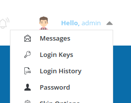
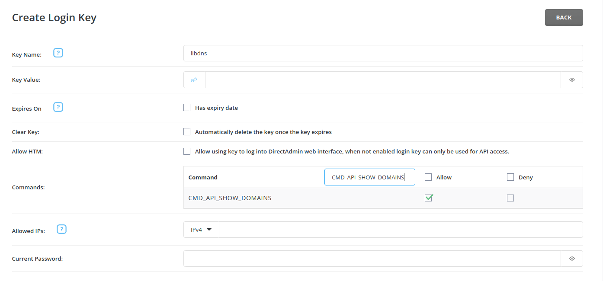

DirectAdmin for [`libdns`](https://github.com/libdns/libdns)
=======================

This package implements the [libdns interfaces](https://github.com/libdns/libdns) for DirectAdmin, allowing you to manage DNS records.

## Authenticating

This package supports API **[Login Keys](https://docs.directadmin.com/directadmin/customizing-workflow/api-all-about.html#creating-a-login-key)** for authentication.

To create a key select `Login Keys` from the top right dropdown menu:

From the `Login Keys` page select `Create Key`

You will need to create a login key with the following settings:

- **Key Name**
  - Select Descriptive Name
- **Expires On**
  - You can set this to whatever you need, but "Never" is likely the best option
- **Clear Key**
  - Unchecked
- **Allow HTM**
  - Unchecked
- **Commands To Allow**
  - `CMD_API_SHOW_DOMAINS`
  - `CMD_API_DNS_CONTROL`

The `CMD_API_SHOW_DOMAINS` permission is needed to get the zone ID, the `CMD_API_DNS_CONTROL` permission is obviously necessary to edit the DNS records.

If you're only using the `GetRecords()` method, you can remove the `CMD_API_DNS_CONTROL` permission to guarantee no changes will be made.

